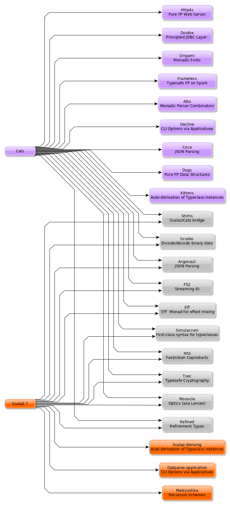

# ScalaZ and Cats

  - [Preface](#sec-1)
  - [Use Cases](#sec-2)
    - [I want to train my Scala team in Functional Programming fundamentals](#sec-2-1)
    - [I'm writing a performance-sensitive application](#sec-2-2)
    - [I want to improve quality-of-life for my Scala devs](#sec-2-3)
    - [I'm writing a library/application that works with a complex DSL](#sec-2-4)
    - [I want to port a well-known, general-purpose Haskell library to Scala](#sec-2-5)
    - [I care about licensing](#sec-2-6)
    - [I care about which stays truer to Haskell](#sec-2-7)
    - [I care about which has more industry backing](#sec-2-8)
    - [I chain operations with `for` / `yield`, isn't that all I need?](#sec-2-9)
    - [I hear the `IO` Monad can help me logically organize my code](#sec-2-10)
    - [Futures suck and I hate JVM thread pools. Help?](#sec-2-11)
    - [Just gimme Monads](#sec-2-12)
    - [I'm interested in other FP options on the JVM](#sec-2-13)
  - [Benchmarks](#sec-3)
    - [Results](#sec-3-1)
    - [Observations](#sec-3-2)
  - [Usage Considerations](#sec-4)
    - [API Accessibility](#sec-4-1)
    - [Features](#sec-4-2)
      - [ScalaZ: `IList`](#sec-4-2-1)
      - [ScalaZ: `Maybe`](#sec-4-2-2)
      - [ScalaZ: `EphemeralStream`](#sec-4-2-3)
      - [ScalaZ: Bifunctor `IO[E, A]`](#sec-4-2-4)
    - [Typeclasses](#sec-4-3)
      - [Custom Typeclasses](#sec-4-3-1)
      - [Instance Derivation](#sec-4-3-2)
      - [Caveat](#sec-4-3-3)
    - [Monadic Recursion](#sec-4-4)
  - [Library Health and Ecosystems](#sec-5)
    - [Project Pulses](#sec-5-1)
    - [Sub-libraries](#sec-5-2)
      - [Shims](#sec-5-2-1)
  - [Resources](#sec-6)
      - [ScalaZ](#sec-6-0-1)
      - [Cats](#sec-6-0-2)
      - [Heretical Materials](#sec-6-0-3)


# Preface<a id="sec-1"></a>

ScalaZ and Cats are libraries which provide Functional Programming constructs for Scala (i.e. `Monad` n' friends).

This repository is a comparison of these two libraries by someone who isn't predisposed to either one. If you're a contributor to either library and notice a discrepancy here, please let me know!

We seek to answer the following question:

> Should I use ScalaZ or Cats?

The answer is, of course, "it depends". What's your use-case?

# Use Cases<a id="sec-2"></a>

## I want to train my Scala team in Functional Programming fundamentals<a id="sec-2-1"></a>

[Functional Programming in Scala](https://www.manning.com/books/functional-programming-in-scala), by Runar Bjarnson and Paul Chiusano, is a valuable book for learning about Functional Programming in general. Otherwise, both ScalaZ and Cats have specific books and professional training available.

ScalaZ:

-   [Functional Programming for Mortals](https://leanpub.com/fpmortals) by Sam Halliday (for FP beginners - assumes an OO Scala background)
-   Training by the [Fantasyland Institute](http://fantasyland.institute/)

Cats:

-   [Scala with Cats](https://underscore.io/books/scala-with-cats/) by Noel Welsh and Dave Gurnell (assumes 1+ years of Scala experience)
-   Training by [Underscore Consultants](https://underscore.io/training/courses/advanced-scala/)

## I'm writing a performance-sensitive application<a id="sec-2-2"></a>

If microbenchmarks and object allocations matter, lean toward Cats, it tends to be faster in aggregate for strict calculations.

If your project has expensive chunks of work that you wish to avoid evaluating unless absolutely needed, lean towards ScalaZ with its preference for lazy evaluation.

## I want to improve quality-of-life for my Scala devs<a id="sec-2-3"></a>

Any dedicated application of FP concepts will help you organize and simplify your code. Libraries like [simulacrum](https://github.com/mpilquist/simulacrum), [decline](https://github.com/bkirwi/decline) and [circe](https://github.com/circe/circe) can provide immediate wins by drastically cutting down boilerplate. The latter two can be used natively with Cats, or via ScalaZ with the [shims](https://github.com/djspiewak/shims) library.

## I'm writing a library/application that works with a complex DSL<a id="sec-2-4"></a>

You probably need Recursion Schemes, which are supplied by the [Matryoshka](https://github.com/slamdata/matryoshka) library in ScalaZ-land.

## I want to port a well-known, general-purpose Haskell library to Scala<a id="sec-2-5"></a>

You'd be a champ to write a backend for both ScalaZ and Cats, but know that Cats has a head start and has a nice set of ported libraries already.

## I care about licensing<a id="sec-2-6"></a>

ScalaZ is BSD3, while Cats is MIT + BSD3, since it derived from ScalaZ originally.

## I care about which stays truer to Haskell<a id="sec-2-7"></a>

ScalaZ does. Its core has a larger API, provides more features up-front, and tends to keep Haskell function names and operators (e.g. `<*>`).

## I care about which has more industry backing<a id="sec-2-8"></a>

[According to this survey](https://www.jetbrains.com/research/devecosystem-2017/scala/), ScalaZ does.

## I chain operations with `for` / `yield`, isn't that all I need?<a id="sec-2-9"></a>

Vanilla `for` [has funny GOTCHAs](https://github.com/lampepfl/dotty/issues/2573) that can affect both performance and usability.

Luckily, the [better-monadic-for](https://github.com/oleg-py/better-monadic-for) plugin can help. It desugars `for` blocks into saner use of `.flatMap` and `.map` to avoid redundant calls, type casts, and object allocations.

## I hear the `IO` Monad can help me logically organize my code<a id="sec-2-10"></a>

Both ScalaZ 7 and Cats have a `effects` subpackage which provides an `IO` type. They both help you contain "real world" side-effects into smaller areas of your code base, freeing the rest of it to purity ([referential transparency](https://en.wikipedia.org/wiki/Referential_transparency)). They also help you wrangle IO-based Exceptions.

A recent (2018 April) development is that of [scalaz-ioeffect](https://github.com/scalaz/ioeffect), a backport of the `IO` Monad implementation from ScalaZ 8. This offers a 2 order-of-magnitude performance improvement over `scalaz-effect`, which puts it about 20% faster than `IO` from Cats, and around 50x faster than `Future` from vanilla Scala.

## Futures suck and I hate JVM thread pools. Help?<a id="sec-2-11"></a>

The `IO` Monad can help you, my friend. First, tell me why `Future` is in your life:

-   **I'm using Actors.** Are you sure you need to be? Actors are very pervasive: once code is "Actory" it's hard to reverse that. Are you sure you don't just need simple concurrency (see below)?
-   **I'm using a database library that returns Futures.** Slick, maybe? Consider [doobie](https://tpolecat.github.io/doobie/) instead, which returns in `IO`.
-   **I'm using a webserver whose endpoints need Futures.** `akka-http`? Play? Consider [http4s](https://http4s.org/), which is built on [fs2](https://github.com/functional-streams-for-scala/fs2) and runs in the `IO` Monad of your choice.
-   **I'm doing some simple concurrency work.** `IO` types come with a friend, [Fiber](https://typelevel.org/cats-effect/datatypes/fiber.html), that allows you to logically and safely model concurrent operations. The result of all operations in `Fiber` must end in `IO`, so concurrent effects can never "escape" into pure code. Bonus: `Fiber` s aren't fixed to JVM threads - they yield intelligently to each other, so you can have as many as you want. You also don't need to worry about `ExecutionContext`.

`Future` does not have your best interests at heart. The fundamental difference between it and `IO` is this: `IO` is a *description* of a runnable program which can be composed with other programs (other `IO`). `Future` is a *running operation*. As soon as you have:

```scala
// Fetch Foo from the DB
val fut: Future[Foo] = ...
```

`fut` is *running*, and you need to keep track of that in your head. This is not the case for `IO`, which makes it much easier to reason about program behaviour in general.

## Just gimme Monads<a id="sec-2-12"></a>

Then either is fine, you can flip a coin.

## I'm interested in other FP options on the JVM<a id="sec-2-13"></a>

If you're not already entrenched in Scala, then you're in luck. [Eta](http://eta-lang.org/) is a Haskell dialect that targets the JVM. It can access a large portion of the existing Haskell library ecosystem, and also has a [Java FFI](http://eta-lang.org/docs/html/eta-tutorials.html#interacting-with-java) that handles the possibility of `null` more explicitely than Scala.

An example:

```haskell
-- | Type-safe import of a Java method that is null-safe.
foreign import java unsafe "@static java.lang.System.getenv"
  getEnv :: String -> IO (Maybe String)

-- | Checks the environment for the HOME environment
-- variable and prints it out if it exists.
main :: IO ()
main = do
  home <- getEnv "HOME"
  case home of
    Just homePath ->
      putStrLn $ "Your home directory is " ++ homePath ++ "!"
    Nothing ->
      putStrLn "Your HOME environment variable is not set"
```

Things like typeclasses and the `IO` Monad are first-class concepts, so no extra library like ScalaZ or Cats is necessary. Eta supports unsigned integer types (called `Word` in Eta/Haskell and sometimes `uint` elsewhere) which neither Java nor Scala have natively. [Eta also has bindings to Apache Spark.](https://github.com/Jyothsnasrinivas/eta-spark-core)

If you're already in Scala-land but want to integrate Eta or gradually migrate to it, [there exists an sbt plugin for Eta<->Scala integration.](https://blog.eta-lang.org/integrating-eta-into-your-scala-projects-a8d494a2c5b0)

# Benchmarks<a id="sec-3"></a>

Benchmarks were performed using the [JMH plugin for SBT](https://github.com/ktoso/sbt-jmh). Vanilla Scala and Haskell results are also included where applicable.

## Results<a id="sec-3-1"></a>

*All times are in nanoseconds, lower numbers are better.*

*[Kittens](https://github.com/milessabin/kittens) and [scalaz-deriving](https://gitlab.com/fommil/scalaz-deriving/) were used to derive Eq instances.*

-   `scalaz-deriving v0.13.1`
-   `kittens 1.0.0`
-   `scalaz-ioeffect-2.3.0` (ScalaZ 8 `IO` backport)
-   `cats-effect-1.0.0-RC2`

| Benchmark                                   | ScalaZ 7.2.24 | Cats 1.1.0 | Vanilla Scala | Haskell 8.2.2 |
|------------------------------------------- |------------- |---------- |------------- |------------- |
| `Eq` - same `[Int]`                         | 10.4\*        | 2.5        | 2.4           | 3,974         |
| `Eq` - different `[Int]`                    | 5,792         | 3,983      | 5,180         |               |
| `Eq` - `while` w/ `Int`                     | 3,188         | 199        | 198           |               |
| `Eq` (derived) - same `[Foo]`               | 10.2          | 2.7        | 2.5           |               |
| `Eq` (derived) - different `[Foo]`          | 2,941         | 45,416     | 2,071         |               |
| `Eq` (derived) - `while` w/ `Foo`           | 463,595       | 45,652     | 5,335         |               |
| `Eq` (hand-written) - same `[Foo]`          | 10.1          | 2.8        | 2.5           |               |
| `Eq` (hand-written) - different `[Foo]`     | 2,962         | 7,835      | 2,071         |               |
| `Eq` (hand-written) - `while` w/ `Foo`      | 8,980         | 5,341      | 5,335         |               |
| `Show` - `[Int]`                            | 571,753       | 45,006     | 41,079        | 38,190        |
| `Show` - `String`                           | 2,841\*       | 3.2        | 2.8           | 140,000       |
| `Foldable.fold` on `[Int]`                  | 3,448         | 5,026      | 7,939         | 3,330         |
| `Foldable.fold` on `[Maybe Int]`            | 6,430         | 12,506     |               | 14,260        |
| `State` - `get`                             | 18.6          | 30.6       |               | 3.9           |
| `State` - `>>=`                             | 90.1          | 139.1      |               | 10.43         |
| `State` - `flatMap`                         | 64.5          | 146.6      |               |               |
| `State` - countdown                         |               | 8,753,951  |               | 6,069         |
| `StateT` - countdown                        | 4,387,924     | 9,744,808  |               | 15.4          |
| `Applicative` - sum `(<*>)`                 | 31,429        | 32,132     |               | 22,140        |
| `Applicative` - sum (cartesian)             | 54,774        | 33,638     |               |               |
| `IO` - Deep `flatMap` - 1000                | 8,869         | 14,559     | 506,433\*     | 616.8         |
| `IO` - Deep `flatMap` - 10000               | 88,675        | 147,758    | 4,859,057     | 6,021         |
| `IO` - Deep `flatMap` - 100000              | 896,186       | 1,305,728  | 46,518,625    | 59,670        |
| `IO` - Deep `flatMap` w/ error ADT - 1k     | 10,843        | 49,625\*   |               | 626           |
| `IO` - Deep `flatMap` w/ error ADT - 10k    | 97,106        | 487,752    |               | 6,058         |
| `IO` - Deep `flatMap` w/ error ADT - 100k   | 1,100,008     | 4,770,665  |               | 60,270        |
| `IO` - Deep `flatMap` w/ `Exception` - 1k   | 12,747        | 12,887     | 479,240       | 1,147         |
| `IO` - Deep `flatMap` w/ `Exception` - 10k  | 103,312       | 102,690    | 4,965,881     | 11,050        |
| `IO` - Deep `flatMap` w/ `Exception` - 100k | 1,079,179     | 1,004,176  | 45,739,491    | 109,600       |

*Notes:*

-   `Eq` benchmarks for ScalaZ employ its `IList` type, not vanilla `List`
-   `Show` for ScalaZ and Cats behaves differently. ScalaZ's prefixes and affixes quotation marks, so that Strings can be copy-pasted between editor and REPL. This is what Haskell's `Show` does as well. Cats does not do this, so it can "return early" in the case of `String`.
-   `IO` benchmarks for Vanilla Scala are usage of `Future`.
-   The *error ADT* benchmarks for Cats and Haskell use `EitherT[IO, E, A]`, while ScalaZ `IO` is a bifunctor with explicit error type: `IO[E, A]`. See the *Features* section for more information.

## Observations<a id="sec-3-2"></a>

-   **Type-safe equality checking is on-par or faster than Vanilla Scala.** So, there seems to be no reason not to use `Eq.===` in all cases.
-   **Avoid Future from Vanilla Scala.** Other than being less safe and harder to reason about, its performance is the worst of the four by far.
-   Except for a few outliers, performance of the two libraries is within the same ballpark.
-   One should favour hand-written typeclass instances for Cats, while deriving seems reliable for ScalaZ.
-   Neither library performs well on recursive Monadic operations (`State` especially). Haskell is two to three orders of magnitude faster in this regard. In particular, GHC heavily optimizes both `IO` and `State` operations.
-   As of 2018 April, both ScalaZ and Cats have fastly improved the performance of their `IO` Monad. This bodes well for Scala-based webservers like [http4s](https://http4s.org/).

# Usage Considerations<a id="sec-4"></a>

## API Accessibility<a id="sec-4-1"></a>

Up front, Cats has much more documentation and usage examples. Their website is good for this. However, given that they both have blog posts and books written about them, overall the availability of resources should be about equal between the two libraries.

The Cats import story is consistent - for most tasks you only need:

```scala
import cats._            /* To refer to top-level symbols like Monad */
import cats.implicits._  /* To get typeclass instances and operators */
```

ScalaZ has a bit more flexibility with their imports, but honestly you can just avoid that and do:

```scala
import scalaz._
import Scalaz._
```

and you'll get all data types, typeclasses, instances, and operators. If you're willing to do that, then the import experience for both libraries is the same.

## Features<a id="sec-4-2"></a>

### ScalaZ: `IList`<a id="sec-4-2-1"></a>

From its Scaladocs:

> Safe, invariant alternative to stdlib `List`. Most methods on `List` have a sensible equivalent here, either on the `IList` interface itself or via typeclass instances (which are the same as those defined for stdlib `List`). All methods are total and stack-safe.

Between being invariant and avoiding connection to Scala's enormous Collections API, `IList` manages to be the fastest general-purpose Scala container type to iterate over. Specifically, it handles tail-recursive algorithms with pattern matching (thus mimicking `.map` and `.foldLeft`) twice as fast as vanilla `List`. Only an `Array` of `Int` or `Double` via a `while` loop can iterate faster.

### ScalaZ: `Maybe`<a id="sec-4-2-2"></a>

From its Scaladocs:

> `Maybe[A]` is isomorphic to `Option[A]`, however there are some differences between the two. `Maybe` is invariant in `A` while `Option` is covariant. `Maybe[A]` does not expose an unsafe get operation to access the underlying `A` value (that may not exist) like `Option[A]` does. `Maybe[A]` does not come with an implicit conversion to `Iterable[A]` (a trait with over a dozen super types).

The implication is that `Maybe` should be safer and slightly more performant than `Option`. Ironically, many ScalaZ methods that yield an "optional" value use `Option` and not `Maybe`.

Where Monad Transformers are concerned, ScalaZ provides both `MaybeT` and `OptionT`.

### ScalaZ: `EphemeralStream`<a id="sec-4-2-3"></a>

From its Scaladocs:

> Like `scala.collection.immutable.Stream`, but doesn't save computed values. As such, it can be used to represent similar things, but without the space leak problem frequently encountered using that type.

The dream of lazy Haskell lists realized? Maybe. With `EphemeralStream` (or `EStream` as the cool kids call it), even the "head" value is lazy. So one would use `EStream` when there's no guarantee that even the first value might be used.

How does it perform?

*All times are in microseconds.*

| Benchmark      | List | IList | Vector | Array | Stream         | EphemeralStream | Iterator |
|-------------- |---- |----- |------ |----- |-------------- |--------------- |-------- |
| `foldLeft`     | 33.3 | 31.3  | 68.9   | 56.4  | 56.9           | 163.1           | 55.4     |
| `foldRight`    | 69.2 | 89.5  | 228.39 | 55.1  | Stack Overflow | Stack Overflow  | 147.6    |
| Tail Recursion | 45.9 | 24.1  |        |       | 69.8           |                 |          |

We see similar slowdowns for chained higher-order ops as well. Looks like building in the laziness has its cost.

### ScalaZ: Bifunctor `IO[E, A]`<a id="sec-4-2-4"></a>

Thanks to the backport library [scalaz-ioeffect](https://github.com/scalaz/ioeffect), ScalaZ 7 `IO` is now a bifunctor: `IO[E, A]`. Any possible error is explicit in the type signature. Typically this will be:

-   `Exception` or `Throwable` for Java-like exceptions
-   `Void` for when an error is provably impossible
-   Some custom error ADT unique to your application

IO-as-a-bifunctor is a living experiment that offers semantics not yet available in Cats or even Haskell's `IO`. The closest approximation is a Cats/Haskell `EitherT[IO, E, A]`, which, having two modes of error reporting has been found over time to not be ideal. In the case of Scala, this `EitherT` wrapping incurs a 4x slowdown.

## Typeclasses<a id="sec-4-3"></a>

Typeclasses are a powerful programming construct to relate data types that have common behaviour. They describe *how* a type should behave, as opposed to what a data type *is* (re: Object Oriented programming).

Both ScalaZ and Cats provide the "standard" typeclasses, namely `Monoid`, `Functor`, `Applicative`, and `Monad`, as well as a wealth of others for more specialized work. In general, the ScalaZ typeclass hierarchy is larger than the Cats' one.

### Custom Typeclasses<a id="sec-4-3-1"></a>

Scala doesn't yet have first-class support for typeclasses. While it's very possible to create trait/object structures that represent a typeclass, there is no built-in syntax for it. The library [simulacrum](https://github.com/mpilquist/simulacrum) helps greatly with this:

```scala
package mylib

import simulacrum._

@typeclass trait Semigroup[A] {
  @op("<>") def combine(x: A, y: A): A
}
```

This *significantly* reduces boilerplate. At compile time, this tiny definition is expanded into everything necessary to use `.combine` (or its optional operator `<>`!) as an injected method on your `A` type. Here's how to write an instance:

```scala
case class Pair(n: Int, m: Int)

object Pair {
  implicit val pairSemi: Semigroup[Pair] = new Semigroup[Pair] {
    def combine(x: Pair, y: Pair): Pair = Pair(x.n + y.n, x.m + y.m)
  }
}
```

This way, whenever `Pair` is in scope, its `Semigroup` instance will also be automatically visible. Defining the `Semigroup[Pair]` somewhere else makes it an *Orphan Instance*, which runs the risk of burdening your users with confusing imports.

Now extend some top-level package object of yours like:

```scala
package object mylib extends Semigroup.ToSemigroupOps
```

And then full use of your typeclass is just one import away!

```scala
import mylib._

scala> Pair(1, 2) <> Pair(3, 4)
res0: Pair = Pair(4, 6)
```

### Instance Derivation<a id="sec-4-3-2"></a>

In Haskell, automatic typeclass instance derivation is frequent:

```haskell
-- The usuals - many more can be derived.
data User = User { age  :: Int
                 , name :: Text
                 } deriving (Eq, Ord, Show, NFData, Generic, ToJSON, FromJSON)
```

Fortunately, both ScalaZ and Cats provide a similar mechanism. Nobody wants to write boilerplate!

[scalaz-deriving](https://gitlab.com/fommil/scalaz-deriving/) exposes the `@deriving` macro for ScalaZ typeclasses:

```scala
@deriving(Equal, Show, Encoder, Decoder)
case class User(age: Int, name: String)
```

Where `Encoder` and `Decoder` are from `play.json`.

[Kittens](https://github.com/milessabin/kittens) provides shapeless-based "semi-auto" derivation for Cats:

```scala
case class User(age: Int, name: String)

object User {
  implicit val userEq: Eq[User] = cats.derive.eq[User]
  implicit val userShow: Show[User] = cats.derive.show[User]
}
```

Which requires more typing, but has more features, like auto-derivation of [higher-kinded things](https://github.com/milessabin/kittens/blob/master/core/src/main/scala/cats/derive.scala) like `Functor`.

For Circe `Encoder` and `Decoder` instances specifically, the following was already possible:

```scala
import io.circe.generic.JsonCodec

@JsonCodec
case class User(age: Int, name: String)
```

### Caveat<a id="sec-4-3-3"></a>

With the current form of the Scala language and compiler, typeclasses have limitations in both performance and correctness. The details are described in the recent paper [The Limitations of Type Classes as Subtyped Implicits](https://adelbertc.github.io/publications/typeclasses-scala17.pdf), by Adelbert Chang.

If this concerns you, there are [safer options](http://eta-lang.org/) for FP on the JVM.

## Monadic Recursion<a id="sec-4-4"></a>

If you're not careful, Monadic Recursion with ScalaZ can blow the JVM stack. For instance, the following will "just work" with Cats:

```scala
def countdown: State[Int, Int] = State.get.flatMap { n =>
  if (n <= 0) State.pure(n) else State.set(n - 1) *> countdown
}
```

Which in ScalaZ would blow the stack for `n` greater than a few thousand. The proper ScalaZ equivalent is:

```scala
def trampolineCountdown: StateT[Trampoline, Int, Int] = State.get.lift[Trampoline].flatMap{ n =>
  if (n <= 0) StateT(_ => Trampoline.done((n,n)))
  else State.put(n - 1).lift[Trampoline] >> trampolineCountdown
}
```

`Trampoline` seems like an implementation detail, but it's exposed to the user here.

A quote from Cats:

> Because monadic recursion is so common in functional programming but is not stack safe on the JVM, Cats has chosen to require `tailRecM` of all monad implementations as opposed to just a subset.

So `tailRecM` gets us stack safety - if you can figure out how to implement it correctly. I tried for `Tree` and was not successful.

John de Goes on ScalaZ 8:

> `tailRecM` will not be a function on Monad, because not all monads can implement it in constant stack space.

So ScalaZ chooses lawfulness over convenience in this case.

# Library Health and Ecosystems<a id="sec-5"></a>

## Project Pulses<a id="sec-5-1"></a>

As of 2017 November 6.

| Project | Releases | Watchers | Stars | Forks | Commits | Prev. Month Commits | ScalaJS | Scala Native |
|------- |-------- |-------- |----- |----- |------- |------------------- |------- |------------ |
| ScalaZ  | 106      | 257      | 3312  | 534   | 6101    | 45                  | Yes     | Yes          |
| Cats    | 22       | 174      | 2118  | 493   | 3280    | 51                  | Yes     | **No**       |

ScalaZ's numbers are higher, but that's to be expected as it's an older project. Otherwise the projects seem to be about equally active. Notably missing is the lack of Scala Native support in Cats.

## Sub-libraries<a id="sec-5-2"></a>

The diagram below looks one-sided, but must be taken with a grain of salt. As projects, Cats and ScalaZ have different aims. Cats has a small, tight core and espouses modularity. ScalaZ frames itself as a batteries-included standard library for FP in Scala. ScalaZ certainly has a larger and more featureful API than Cats at current. This will be increasingly true for the up-coming ScalaZ 8, which aims to provide the equivalent functionality of Dogs, Monocle, and Matryoshka directly. It also plans to provide low-level concurrency primitives which see no analogue in Cats or Vanilla Scala.

That in mind, here is a simplified view of their library ecosystems:



*Notes:*

-   Origami is a port of Haskell's [foldl](https://hackage.haskell.org/package/foldl) library
-   Atto is a port of Haskell's [attoparsec](https://hackage.haskell.org/package/attoparsec) library
-   Decline and optparse-applicative are ports of Haskell's [optparse-applicative](https://hackage.haskell.org/package/optparse-applicative) library
-   Refined is a port of Haskell's [refined](https://hackage.haskell.org/package/refined) library
-   Monocle is a port of Haskell's [lens](https://hackage.haskell.org/package/lens) library

### Shims<a id="sec-5-2-1"></a>

Libraries like `circe`, `atto` and `decline` are immense standard-of-living improvements for Scala developers. Luckily, the [shims library](https://github.com/djspiewak/shims) allows us to use them via ScalaZ, too. Likewise, Matryoshka becomes usable via Cats. From the `shims` project:

> Shims aims to provide a convenient, bidirectional, and transparent set of conversions between scalaz and cats, covering typeclasses (e.g. `Monad`) and data types (e.g. `\/`). By that I mean, with shims, anything that has a `cats.Functor` instance also has a `scalaz.Functor` instance, and vice versa.

[Here is a working example:](https://github.com/fosskers/shimmy)

```scala
package shimmy

import scalaz._
import Scalaz._
import shims._
import com.monovore.decline._  /* Depends on Cats */

object Shimmy extends CommandApp(
  name = "shimmy",
  header = "Demonstrate how shims works.",
  main = {
    /* These are `decline` data types with `Applicative` instances from Cats */
    val foo = Opts.option[String]("foo", help = "Foo")
    val bar = Opts.option[Int]("bar", help = "Bar")
    val baz = Opts.flag("baz", help = "Baz").orFalse

    /* These are ScalaZ operators that use ScalaZ's `Applicative` */
    (foo |@| bar |@| baz) { (_, _, _) => println("It worked!") }
  }
)
```

# Resources<a id="sec-6"></a>

The tendency is for Cats to have better documentation and examples up-front, while ScalaZ has an extensive `examples` subpackage.

### ScalaZ<a id="sec-6-0-1"></a>

-   [Functional Programming for Mortals](https://leanpub.com/fpmortals) by Sam Halliday (book)
-   [Learning ScalaZ](http://eed3si9n.com/learning-scalaz/index.html) by Eugene Yokota (blog series)
-   [Cheatsheet](http://eed3si9n.com/scalaz-cheat-sheet) (typeclass usage and imports)
-   [ScalaZ README](https://github.com/scalaz/scalaz)
-   [Scaladocs](https://scalaz.github.io/scalaz/#scaladoc)
-   [ScalaZ Gitter](https://gitter.im/scalaz/scalaz)

### Cats<a id="sec-6-0-2"></a>

-   [Cats Website](https://typelevel.org/cats/)
-   [Scala with Cats](https://underscore.io/books/scala-with-cats/) by Noel Walsh and Dave Gurnell (book)
-   [Scaladocs](https://typelevel.org/cats/api/)
-   [Herding Cats](http://eed3si9n.com/herding-cats/) by Eugene Yokota (blog series)
-   [Cats Gitter](https://gitter.im/typelevel/cats)

### Heretical Materials<a id="sec-6-0-3"></a>

-   [The Limitations of Type Classes as Subtyped Implicits](https://adelbertc.github.io/publications/typeclasses-scala17.pdf) by Adelbert Chang
-   [The Eta Language](http://eta-lang.org/)
